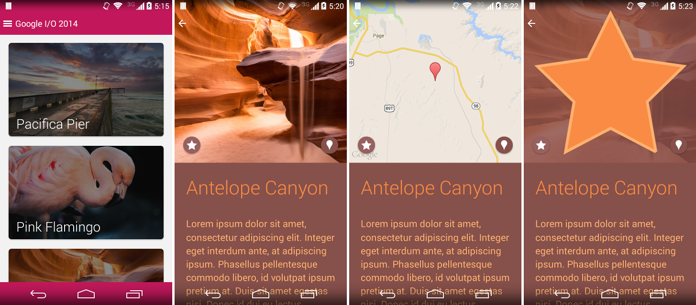

Material Witness Compat
=======================

A Google I/O 2014 demo written by Romain Guy [http://www.curious-creature.org][1] ported to work on all versions of the platform back to Android 2.3.3 (API Level 10). 

Material Witness is a sample application for the new Material Design APIs introduced in the Android L Preview SDK:

* Custom theme colors
* Dynamic palette
* Circular reveal
* Activity transitions

And a few other things such as colored status and navigation bars, path tracing, etc.

The complete video of the Google I/O 2014 talk detailing how this application works can be found on [YouTube][2].

Pre-Android "L" Note
===================

While Android "L" is in preview, the support library associated with RecyclerView has its minimum SDK version set to L (v21). At least for the time being, in order to use these samples on an earlier Android device (they work back to v7), add the following line to your AndroidManifest.xml file (under the `<manifest>` element:

    <uses-sdk tools:node="replace" />

This will cause Gradle to ignore the updated SDK version in the library.

Demo
====

All gifs are in slow motion.

| Activity transitions                          | Circular reveal                               | Path tracing                                  |
|:---------------------------------------------:|:---------------------------------------------:|:---------------------------------------------:|
|                  |                  |                  |
| From [Custom Activity Animations][3]          | From [Android Recipe #2, fun with shaders][4] | From [Android Recipe #4, path tracing][5]     |

How to use this source code
===========================

The google-io-2014 project can be opened in Android Studio 0.6.1 or later. It contains a single module
called **app** in the `app/` folder.

The project can be compiled from the command line using Gradle.

The actual source code and resources can be found in `app/src/main/`. The only dependencies are in `app/lib/`.

License
=======

    Copyright 2014 Rahul Parsani

    Licensed under the Apache License, Version 2.0 (the "License");
    you may not use this file except in compliance with the License.
    You may obtain a copy of the License at

       http://www.apache.org/licenses/LICENSE-2.0

    Unless required by applicable law or agreed to in writing, software
    distributed under the License is distributed on an "AS IS" BASIS,
    WITHOUT WARRANTIES OR CONDITIONS OF ANY KIND, either express or implied.
    See the License for the specific language governing permissions and
    limitations under the License.

Library licenses
================

__androidsvg-1.2.1__ is subject to the [Apache License, Version 2.0][6]. More information on [the official web site][7].

__android-support-v7-palette__ is subject to the [Apache License, Version 2.0][6]

__android-support-v7-cardview__ is subject to the [Apache License, Version 2.0][6]

__nineoldandroids-2.4.0__ is subject to the [Apache License, Version 2.0][6]. More information on [the official web site][8].

__roundedimageview-1.3.0__ is subject to the [Apache License, Version 2.0][6]. More information on [the official web site][9].

__systembartint-1.0.3__ is subject to the [Apache License, Version 2.0][6]. More information on [the official web site][10].

[1]: http://www.curious-creature.org
[2]: https://www.youtube.com/watch?v=97SWYiRtF0Y
[3]: http://www.youtube.com/watch?v=CPxkoe2MraA
[4]: http://www.curious-creature.org/2012/12/13/android-recipe-2-fun-with-shaders/
[5]: http://www.curious-creature.org/2013/12/21/android-recipe-4-path-tracing/
[6]: http://apache.org/licenses/LICENSE-2.0.html
[7]: https://code.google.com/p/androidsvg/
[8]: http://nineoldandroids.com/
[9]: https://github.com/vinc3m1/RoundedImageView
[10]: https://github.com/jgilfelt/SystemBarTint
